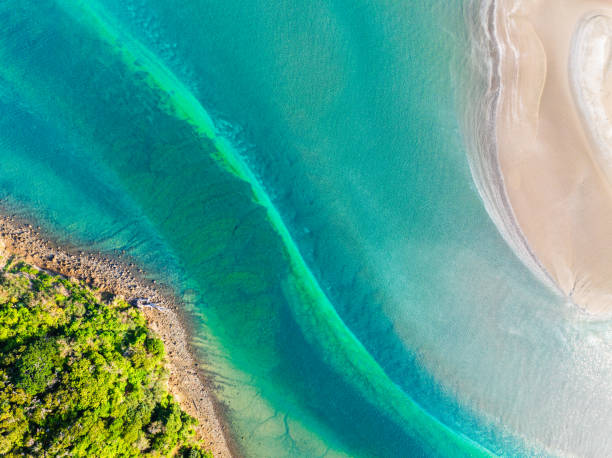
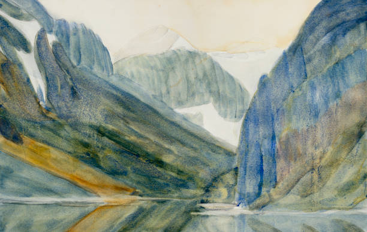

# Quiz game
## Contents
1. About this project
2. User Stories
3. Wireframes
4. Website Iterations
5. Code Development
6. Working with Co-pilot
7. Bugs
8. Code Validators
9. Features
10. Accessibility
11. Miscellaneous

## About QuizMaster

## User Stories

### User friendly navigation and responsive design (must-have)

#### User story 1:

As a First-Time Visitor, I need easy navigation and a user-friendly design, including a responsive layout for my device, so I can find information quickly and efficiently without frustration.

#### Acceptance Criteria

The website is fully responsive across various devices and screen sizes.

Site layout and navigation are intuitive, allowing easy access to different sections.

#### Tasks

Apply responsive design principles using Bootstrap to ensure the website is accessible on various devices.

Arrange the site layout and navigation based on best practices, ensuring all key sections and pages are easily accessible.

### Creating Categories (must-have)

#### User story 2:

I want to test my knowledge in different areas.

#### Acceptance Criteria

The quiz will contain a least 4 different categories.

Category must be pressed before quiz starts.

#### Tasks

Use JavaScript for accessible categories.

Use JavaScript for input validation.

### Results (must-have)

#### User Story 3:
As a user I want to know straight away if I have answered correctly.

#### Acceptance Criteria

The results will be shown as green for correct and red for incorrect.

The quiz will be multiple choice and an answer must selected before the user moves on.

The quiz will have 3-4 choices per category.

#### Task

Using JavaScript to check the answer.

Using JavaScript allow user input.

Write the JavaScript needed for the game logic.

### Accessibility and performance (must-have)

#### User Story 4:

As a site owner, I want the website to be responsive and pass basic accessibility checks (ARIA roles, keyboard navigation) so it’s usable by a wide audience.

#### Acceptance Criteria

The website should have an acceptable accessibility result.

Code should run smoothly without error.

#### Tasks

Use W3c, jigsaw and python tutor as code validators.

Use Lighthouse to check the accessibility of the website.

### Leader board (should-have)

#### User story 5:
As a user I would like to see where I rank among other participants

#### Acceptance criteria

Leader board beside the quiz to show rankings of different participants

User’s results are logged immediately

Adjust the rankings by category

#### Tasks

Use HTML/CSS to build a leader board section

Use JavaScript to ensure the results of the user are logged automatically and by category.

### Difficulty levels (could-have)

#### User Story 6:
As a user I would like to challenge myself with different difficulty levels.

#### Acceptance criteria

Each category has three difficulty levels: easy, medium, hard.

Difficulty option must be selected before quiz begins.

Scores from all three levels can be aggregated.

#### Tasks

Use HTML/CSS to create the difficulty selection dropdown menu.

Use JavaScript to ensure the questions are from the correct difficulty level and the scores are correct.

### Friend Button (could-have)

#### User Story 7:

As a user, I want to be able to invite my friends directly from the quiz using an invite button. So that they can quickly join the same quiz and we can play together in real time.

#### Acceptance Criteria

The quiz screen displays a clearly visible Invite button.

When clicked, the button opens a modal or menu with sharing options (e.g., copy link, send via email, share on social apps).

See the inviter’s name or nickname.

Quiz ID or session code
#### Tasks

Create an user-friendly message (e.g., “Join me in this quiz!”).

Use HTML so that people are redirected to the quiz lobby.

Use JavaScript to alert the inviter when friends join.

## Wireframes

## Website Iterations

### Website v2

### Website v3

### Website v4

## Code Development

### HTML

### CSS

### JavaScript

## Working with Co-pilot

## Bugs

## Code Validators

## Features

## Accessibility

### Lighthouse

#### 1

#### 2

#### Desktop

#### 3

#### Desktop 2

#### 4

#### Desktop 3

#### Desktop 4

## Miscellaneous

